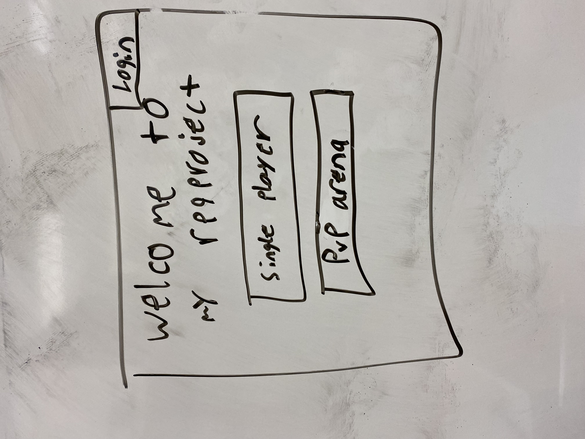
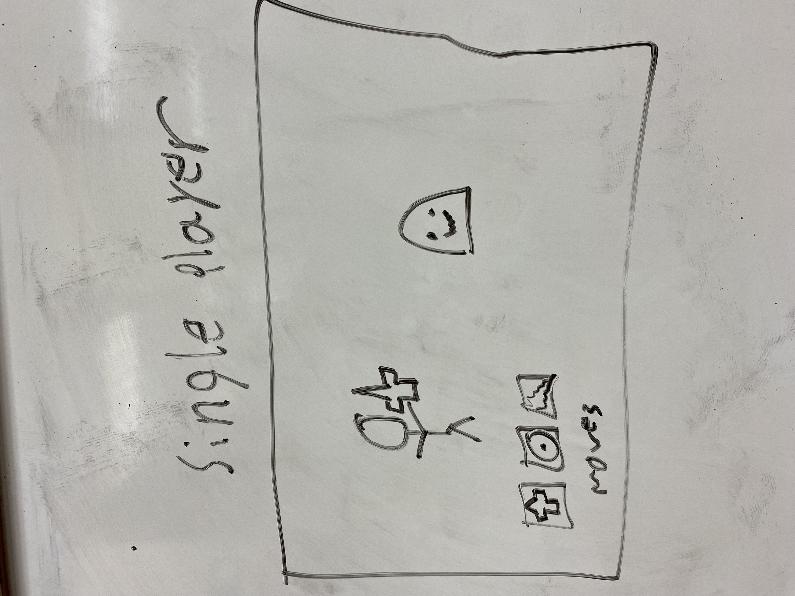
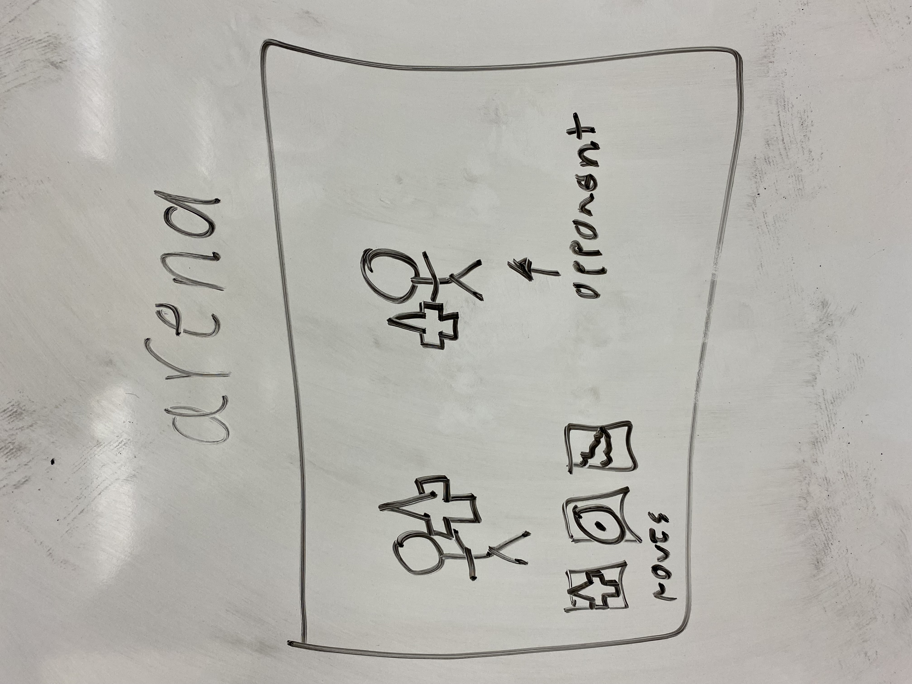

# cs260\
1. HTML -  Uses correct HTML structure for application. Three HTML pages. One for login, one for Single player, and one for online pvp (arena).
2. CSS - Application styling that looks good on different screen sizes, uses good whitespace, color choice and contrast to give an RPG feel.
3. JavaScript - Provides login
4. React - Single page application with views componentized and reactive to user's actions.
5. Service - Backend service with endpoints for selecting an arena move and retriving your opponent's move as well as connecting to the [Unsplash API](https://unsplash.com/documentation) for generating a character image (remember to attribute the photographer so it's not illegal lol).
6. DB/Login - Store users, characters, and win/loss reord. Register and login users. Credentials securely stored in database. Can't fight in arena unless authenticated.
7. WebSocket - when in the PvP arena a player will chose their move and it will then be broadcasted to their opponent at the end of their turn.

## HTML
- Added a page for PvP, PvE, Login, and viewing your characters
- Added HTML for each of those pages
- Added linking capabilities to/from each of those pages

## Below are the images, pardon the low quality

# Home page view

# Single player view

# Online arena view

